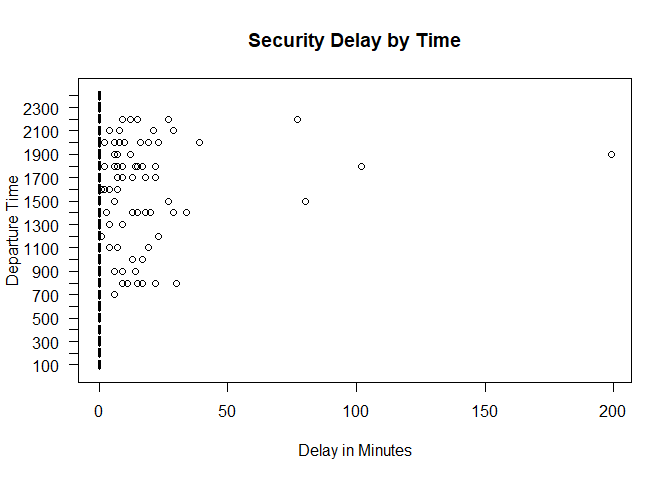
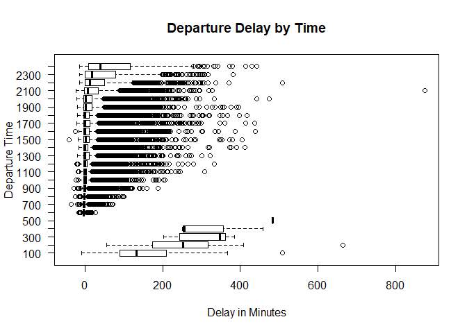
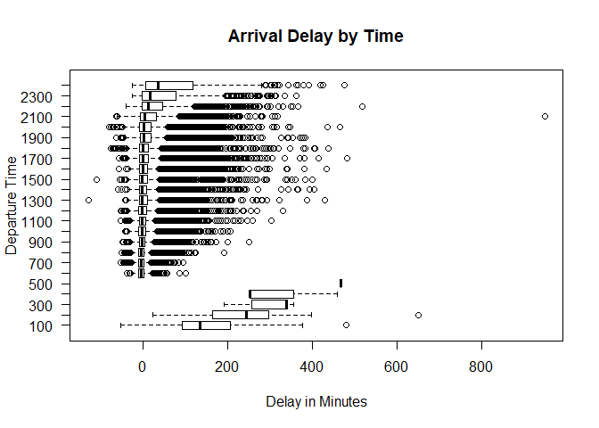
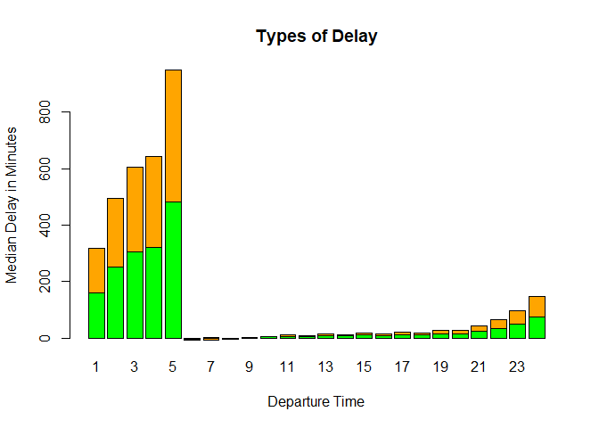
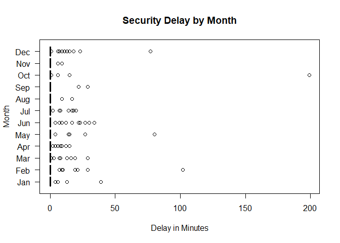
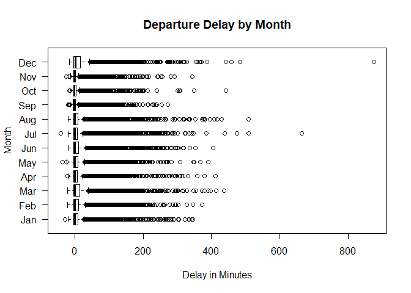
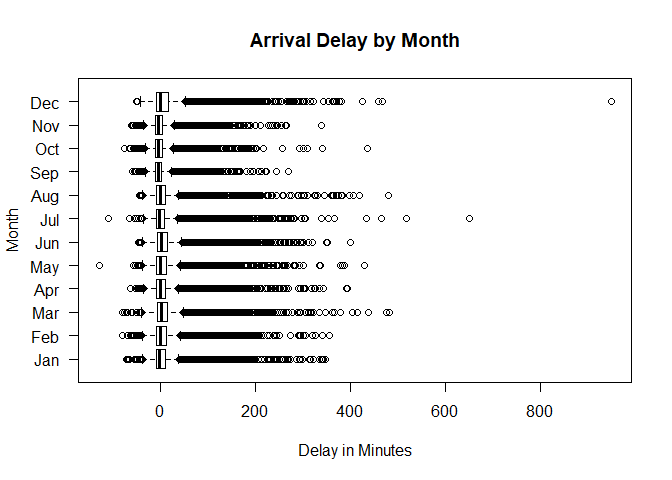
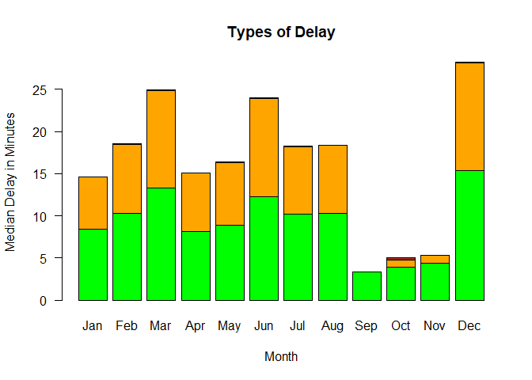
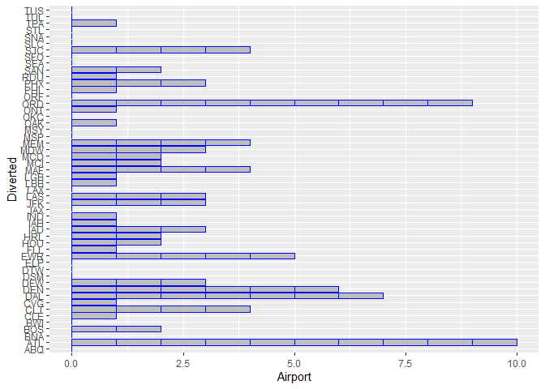
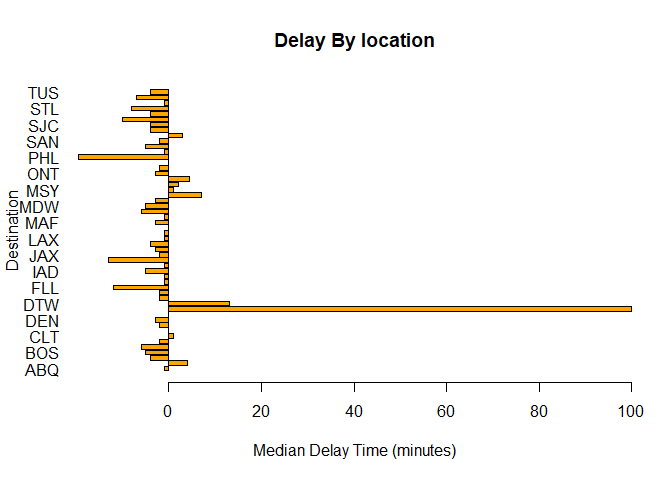

Using the provided 2008 Data, We will investigate questions that would
be relevant to a consumer looking to fly out of Austin.

1.  What is the best time of day to fly to minimize delays?

We will consider three types of delays: security delays, depature
delays, and arrival delays.Boxplots will serve as useful tools to
visualize the data.They will show not only mean delay times, but also
show case variance within the data, as well as acount for early
arrivals.

It seems that it is best to depart or arrive early in the morning,
though not before to 5 am. Actually, any time between 5 am and 8 pm
seems reasonble. The median flying time remains stable until late at
night. There is also greater variance as it gets later.

We can summarize this information using stacked barplots. We have to
create a table with the median delay time for all of the flights.
 Arrival and
departure delays are strongly correlated. Now we will look at the
Delay’s by time of year.

Median delays stay around 0, with a slightly greater variance for
December. Now, let’s look at the bargraphs.

 Now, let’s
look for patterns amoung different flights.

    ##       Year          Month         DayofMonth      DayOfWeek    
    ##  Min.   :2008   Min.   : 1.00   Min.   : 1.00   Min.   :1.000  
    ##  1st Qu.:2008   1st Qu.: 3.00   1st Qu.: 8.00   1st Qu.:2.000  
    ##  Median :2008   Median : 6.00   Median :16.00   Median :4.000  
    ##  Mean   :2008   Mean   : 6.29   Mean   :15.73   Mean   :3.902  
    ##  3rd Qu.:2008   3rd Qu.: 9.00   3rd Qu.:23.00   3rd Qu.:6.000  
    ##  Max.   :2008   Max.   :12.00   Max.   :31.00   Max.   :7.000  
    ##                                                                
    ##     DepTime       CRSDepTime      ArrTime       CRSArrTime  
    ##  Min.   :   1   Min.   :  55   Min.   :   1   Min.   :   5  
    ##  1st Qu.: 917   1st Qu.: 915   1st Qu.:1107   1st Qu.:1115  
    ##  Median :1329   Median :1320   Median :1531   Median :1535  
    ##  Mean   :1329   Mean   :1320   Mean   :1487   Mean   :1505  
    ##  3rd Qu.:1728   3rd Qu.:1720   3rd Qu.:1903   3rd Qu.:1902  
    ##  Max.   :2400   Max.   :2346   Max.   :2400   Max.   :2400  
    ##  NA's   :1413                  NA's   :1567                 
    ##  UniqueCarrier     FlightNum       TailNum      ActualElapsedTime
    ##  WN     :34876   Min.   :   1          : 1104   Min.   : 22.0    
    ##  AA     :19995   1st Qu.: 640   N678CA :  195   1st Qu.: 57.0    
    ##  CO     : 9230   Median :1465   N511SW :  180   Median :125.0    
    ##  YV     : 4994   Mean   :1917   N526SW :  176   Mean   :120.2    
    ##  B6     : 4798   3rd Qu.:2653   N528SW :  172   3rd Qu.:164.0    
    ##  XE     : 4618   Max.   :9741   N520SW :  168   Max.   :506.0    
    ##  (Other):20749                  (Other):97265   NA's   :1601     
    ##  CRSElapsedTime     AirTime          ArrDelay           DepDelay      
    ##  Min.   : 17.0   Min.   :  3.00   Min.   :-129.000   Min.   :-42.000  
    ##  1st Qu.: 58.0   1st Qu.: 38.00   1st Qu.:  -9.000   1st Qu.: -4.000  
    ##  Median :130.0   Median :105.00   Median :  -2.000   Median :  0.000  
    ##  Mean   :122.1   Mean   : 99.81   Mean   :   7.065   Mean   :  9.171  
    ##  3rd Qu.:165.0   3rd Qu.:142.00   3rd Qu.:  10.000   3rd Qu.:  8.000  
    ##  Max.   :320.0   Max.   :402.00   Max.   : 948.000   Max.   :875.000  
    ##  NA's   :11      NA's   :1601     NA's   :1601       NA's   :1413     
    ##      Origin           Dest          Distance        TaxiIn       
    ##  AUS    :49623   AUS    :49637   Min.   :  66   Min.   :  0.000  
    ##  DAL    : 5583   DAL    : 5573   1st Qu.: 190   1st Qu.:  4.000  
    ##  DFW    : 5508   DFW    : 5506   Median : 775   Median :  5.000  
    ##  IAH    : 3704   IAH    : 3691   Mean   : 705   Mean   :  6.413  
    ##  PHX    : 2786   PHX    : 2783   3rd Qu.:1085   3rd Qu.:  7.000  
    ##  DEN    : 2719   DEN    : 2673   Max.   :1770   Max.   :143.000  
    ##  (Other):29337   (Other):29397                  NA's   :1567     
    ##     TaxiOut         Cancelled       CancellationCode    Diverted       
    ##  Min.   :  1.00   Min.   :0.00000    :97840          Min.   :0.000000  
    ##  1st Qu.:  9.00   1st Qu.:0.00000   A:  719          1st Qu.:0.000000  
    ##  Median : 12.00   Median :0.00000   B:  605          Median :0.000000  
    ##  Mean   : 13.96   Mean   :0.01431   C:   96          Mean   :0.001824  
    ##  3rd Qu.: 16.00   3rd Qu.:0.00000                    3rd Qu.:0.000000  
    ##  Max.   :305.00   Max.   :1.00000                    Max.   :1.000000  
    ##  NA's   :1419                                                          
    ##   CarrierDelay     WeatherDelay       NASDelay      SecurityDelay   
    ##  Min.   :  0.00   Min.   :  0.00   Min.   :  0.00   Min.   :  0.00  
    ##  1st Qu.:  0.00   1st Qu.:  0.00   1st Qu.:  0.00   1st Qu.:  0.00  
    ##  Median :  0.00   Median :  0.00   Median :  2.00   Median :  0.00  
    ##  Mean   : 15.39   Mean   :  2.24   Mean   : 12.47   Mean   :  0.07  
    ##  3rd Qu.: 16.00   3rd Qu.:  0.00   3rd Qu.: 16.00   3rd Qu.:  0.00  
    ##  Max.   :875.00   Max.   :412.00   Max.   :367.00   Max.   :199.00  
    ##  NA's   :79513    NA's   :79513    NA's   :79513    NA's   :79513   
    ##  LateAircraftDelay
    ##  Min.   :  0.00   
    ##  1st Qu.:  0.00   
    ##  Median :  6.00   
    ##  Mean   : 22.97   
    ##  3rd Qu.: 30.00   
    ##  Max.   :458.00   
    ##  NA's   :79513

    ## [1] 49623    29

 The overall
number of delays is not that great for the airports. ATL has the worst
fo it with 10 diverted flights over the course of the year. It does not
give us the best intuition about what would be a good place to fly to.

To identify those airports that it is worst to fly into, let’s again
look at median arrival delays.

 We see that
for most airports, flights typcially arrive before there scheduled
times. There are only a few outliers.
