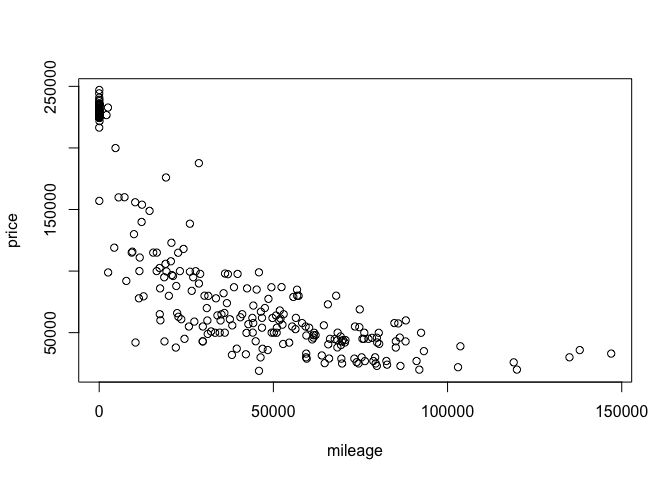
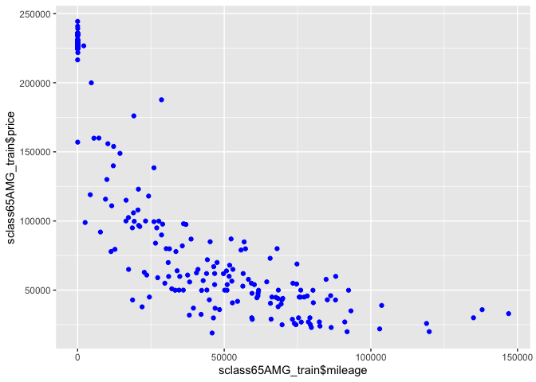

The variables involved
======================

    ##        id             trim         subTrim      condition    isOneOwner
    ##  Min.   :    2   550    :21836   Hybrid:  190   CPO : 3586   f:25340   
    ##  1st Qu.:13231   430    : 2071   unsp  :29276   New :10317   t: 4126   
    ##  Median :26254   500    : 2002                  Used:15563             
    ##  Mean   :26269   63 AMG : 1413                                         
    ##  3rd Qu.:39293   600    :  527                                         
    ##  Max.   :52572   350    :  416                                         
    ##                  (Other): 1201                                         
    ##     mileage            year          color        displacement  
    ##  Min.   :     1   Min.   :1988   Black  :12838   4.6 L  :13599  
    ##  1st Qu.:    14   1st Qu.:2007   Silver : 6095   5.5 L  : 9154  
    ##  Median : 26120   Median :2012   White  : 4418   4.3 L  : 2071  
    ##  Mean   : 40387   Mean   :2010   Gray   : 2007   5.0 L  : 2002  
    ##  3rd Qu.: 68234   3rd Qu.:2015   Blue   : 1599   6.0 L  :  403  
    ##  Max.   :488525   Max.   :2015   unsp   : 1467   6.3 L  :  391  
    ##                                  (Other): 1042   (Other): 1846  
    ##        fuel           state           region              soundSystem   
    ##  Diesel  :  312   CA     : 5262   SoA    :7805   Alpine         :    2  
    ##  Gasoline:28628   FL     : 3559   Pac    :5844   Bang Olufsen   :  177  
    ##  Hybrid  :  189   NY     : 2754   Mid    :5824   Bose           :  943  
    ##  unsp    :  337   TX     : 2458   WSC    :2865   Boston Acoustic:    1  
    ##                   NJ     : 2266   ENC    :2496   Harman Kardon  : 4120  
    ##                   GA     : 1408   New    :1421   Premium        : 9694  
    ##                   (Other):11759   (Other):3211   unsp           :14529  
    ##    wheelType       wheelSize      featureCount        price       
    ##  Alloy  :14565   unsp   :25293   Min.   :  0.00   Min.   :   599  
    ##  Chrome :   80   18     : 1774   1st Qu.: 18.00   1st Qu.: 28995  
    ##  Premium:  424   19     : 1297   Median : 53.00   Median : 56991  
    ##  Steel  :   49   20     :  813   Mean   : 46.48   Mean   : 67001  
    ##  unsp   :14348   17     :  149   3rd Qu.: 70.00   3rd Qu.:108815  
    ##                  16     :  107   Max.   :132.00   Max.   :299000  
    ##                  (Other):   33

2ND data set : 65AMG
====================

    ##        id             trim       subTrim    condition  isOneOwner
    ##  Min.   : 1060   65 AMG :292   Hybrid:  0   CPO : 26   f:254     
    ##  1st Qu.:13977   320    :  0   unsp  :292   New : 91   t: 38     
    ##  Median :26557   350    :  0                Used:175             
    ##  Mean   :26444   400    :  0                                     
    ##  3rd Qu.:38687   420    :  0                                     
    ##  Max.   :52326   430    :  0                                     
    ##                  (Other):  0                                     
    ##     mileage            year          color      displacement
    ##  Min.   :     1   Min.   :2006   Black  :182   6.0 L  :285  
    ##  1st Qu.:    20   1st Qu.:2007   Silver : 39   unsp   :  7  
    ##  Median : 28803   Median :2010   White  : 27   3.0 L  :  0  
    ##  Mean   : 33700   Mean   :2010   Gray   : 22   3.2 L  :  0  
    ##  3rd Qu.: 58496   3rd Qu.:2015   unsp   : 10   3.5 L  :  0  
    ##  Max.   :146975   Max.   :2015   Blue   :  7   3.7 L  :  0  
    ##                                  (Other):  5   (Other):  0  
    ##        fuel         state         region            soundSystem 
    ##  Diesel  :  0   CA     : 75   Pac    :79   Alpine         :  0  
    ##  Gasoline:279   FL     : 44   SoA    :63   Bang Olufsen   : 31  
    ##  Hybrid  :  0   TX     : 27   Mid    :34   Bose           : 13  
    ##  unsp    : 13   IL     : 18   ENC    :33   Boston Acoustic:  0  
    ##                 NY     : 15   WSC    :32   Harman Kardon  : 42  
    ##                 NJ     : 12   Mtn    :17   Premium        : 92  
    ##                 (Other):101   (Other):34   unsp           :114  
    ##    wheelType     wheelSize    featureCount        price       
    ##  Alloy  :136   unsp   :252   Min.   :  0.00   Min.   : 18990  
    ##  Chrome :  2   20     : 39   1st Qu.: 17.00   1st Qu.: 48711  
    ##  Premium:  9   18     :  1   Median : 58.00   Median : 79994  
    ##  Steel  :  0   16     :  0   Mean   : 48.09   Mean   :117121  
    ##  unsp   :145   17     :  0   3rd Qu.: 72.00   3rd Qu.:225975  
    ##                19     :  0   Max.   :112.00   Max.   :247075  
    ##                (Other):  0

Make a train-test split
=======================

\#Training

\#Testing

define a helper function for calculating RMSE
=============================================

\#create and set up the empty set ‘knn\_results’ to save values of ‘k’

Run a loop of k values
======================

Look at price vs mileage for each trim level
============================================

Find the optimal k
==================

    ## [1] 19

\#Regress on optimal value of k

\#Plotting the fitted model

